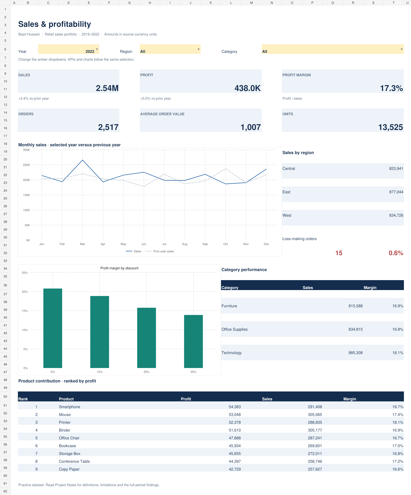

# Excel Sales & Profitability Dashboard

An Excel analysis of 10,000 retail sales records, covering 2019–2022. The project examines sales growth, product contribution and the relationship between discounting and profit margin.

**[Download the Excel workbook](Sales_Performance_Dashboard.xlsx)**

## Business question

Where are sales and profit coming from, and which parts of the business need a closer profitability review?

The dashboard lets a reviewer select a year, region and category, then compare the same population across KPIs, monthly trends and product results.

## Selected findings

| Measure | Result | Scope |
|---|---:|---|
| Sales | 10,033,715.95 | All records, 2019–2022 |
| Profit | 1,711,180.34 | All records, 2019–2022 |
| Profit margin | 17.05% | Total profit / total sales |
| Orders | 10,000 | Source Order IDs are unique |
| Sales growth | 3.36% | 2022 versus 2021 |
| Profit growth | 5.00% | 2022 versus 2021 |

Amounts are in the source's unspecified currency units. No exchange-rate conversion has been applied.

- **Discounting deserves a closer review.** The 30% discount group has a 13.99% margin, compared with 20.35% for zero-discount orders. The 6.35 percentage-point difference is an observed association. Product mix and costs would need to be controlled before making a pricing decision.
- **Sales leadership and profit leadership differ.** Binder leads product-name sales at 1,179,000.64. Conference Table leads profit at 203,828.28.
- **Storage Box has the lowest product-name margin:** 16.38%. Review its mix and cost structure before deciding whether to change pricing or promotions.
- **Loss-making orders are uncommon and small in aggregate.** There are 79 negative-profit orders (0.79% of orders), totaling a loss of 391.88. A large savings claim would not be supported by this data.

See [CASE_STUDY.md](CASE_STUDY.md) for the reasoning and suggested follow-up analysis.

## Workbook features

- Year, Region and Category dropdown filters shared by every dashboard KPI and chart.
- Sales, profit, weighted profit margin, orders, units and average order value.
- Monthly sales compared with the previous year, using the same filters.
- Regional sales, discount-level margins and category margins.
- Product names ranked dynamically by profit, with sales and margins alongside.
- An auditable Analysis sheet with formulas and six reconciliation checks.
- A filterable source table with typed dates, text ZIP codes and highlighted negative profit.

### How to use

1. Download `Sales_Performance_Dashboard.xlsx` and open it in Microsoft Excel. Enable editing if prompted for a downloaded file.
2. On **Dashboard**, change the amber Year, Region and Category dropdowns. The saved opening view is 2022, all regions and all categories.
3. Use **Analysis** to inspect the calculations. The reconciliation differences should remain zero, within 0.01 for monetary rounding.
4. Use **Data** to inspect individual source records and **Project Notes** for definitions and limitations.

When Year is **All**, the monthly chart combines matching calendar months across all four years. Year-on-year comparisons are unavailable for **All** and **2019**, since those selections have no comparable previous period in this workbook.

## Data preparation and quality

The supplied workbook's `Raw_Data` sheet is the source. All 10,000 records were retained.

| Check or transformation | Result |
|---|---|
| Parse source date strings as DD/MM/YYYY | Converted to sortable Excel dates |
| Postal codes | Stored as text identifiers |
| Exact duplicate rows | 0 |
| Duplicate Order IDs | 0 |
| Blank source fields | 0 |
| Ship dates before order dates | 0 |
| Negative-profit rows | 79; retained as valid analytical observations |
| Product-name groups | 9; all are shown, rather than calling this a top-10 list |

The source has generic customer names and one unique Customer ID and Product ID per record. It is treated as a practice dataset, with an unverified original publisher. Product analysis groups by Product Name. This is not evidence of a real client engagement, and it does not support repeat-customer analysis or validated SKU-level conclusions.

## Calculation design

| Metric | Definition |
|---|---|
| Sales | SUM of source Sales within the selection |
| Profit | SUM of source Profit within the selection |
| Profit margin | Selected profit / selected sales |
| Orders | Selected row count; valid here because Order ID is unique |
| Average order value | Selected sales / selected orders |
| YoY growth | Current-year value / previous-year value − 1 |
| Loss-making order rate | Orders with Profit < 0 / selected orders |

The workbook uses Excel Tables, `SUMIFS`, `COUNTIFS`, `INDEX/MATCH`, `RANK`, date functions, conditional formatting, validation dropdowns and standard charts. It uses formula-based controls in place of the earlier PivotTable and slicer layout. No VBA, Power Query or Power Pivot is claimed in this version.

## Validation and update scope

Headline results were reconciled to independent source calculations. Filter combinations were checked across all years and individual years, regions and categories. A source-value change was used to verify recalculation, then restored. Monthly, regional, category, product, segment and discount results were reconciled to their corresponding KPIs.

Formula results, exported chart references and LibreOffice recalculation after filter/source changes were checked. Native desktop Excel UI behavior was not tested in this environment. If formulas do not update after a selection, check that Excel calculation is set to Automatic.

The formulas cover the current 10,000 rows. Editing values within that range recalculates results. Appending records requires extending the source ranges in Analysis and the SalesData table. New years also require updating the year dropdown, period limits and all-year month summaries. Recheck unique Order IDs before reusing the order-count calculation.

## Files

| File | Purpose |
|---|---|
| `Sales_Performance_Dashboard.xlsx` | Interactive workbook and source data |
| `Dashboard.png` | Preview of the saved opening view |
| `CASE_STUDY.md` | Findings, recommendations and analytical limits |
| `INTERVIEW_GUIDE.md` | Calculation walkthrough and practice questions |
| `RESUME_BULLETS.md` | Evidence-based project wording |

**Basit Hussain**

[GitHub](https://github.com/Basit52692) · [LinkedIn](https://www.linkedin.com/in/basit-hussain-749874243/)
